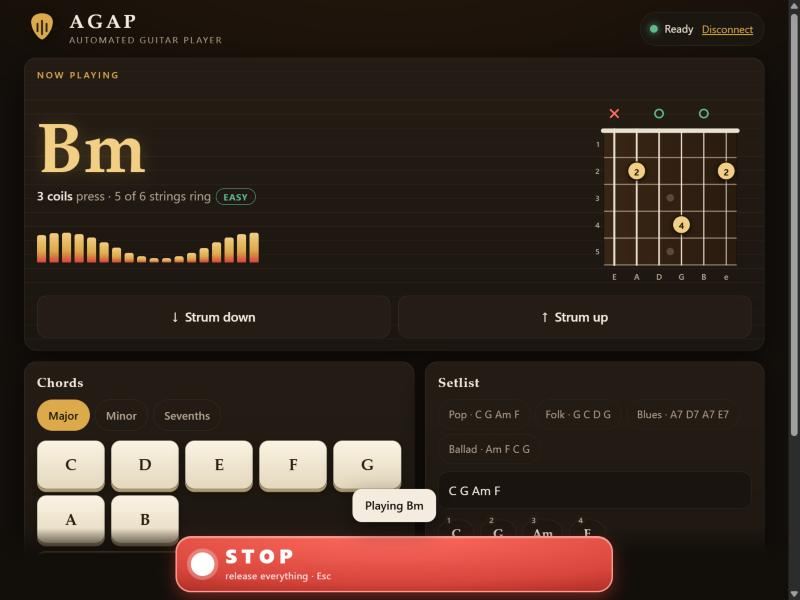
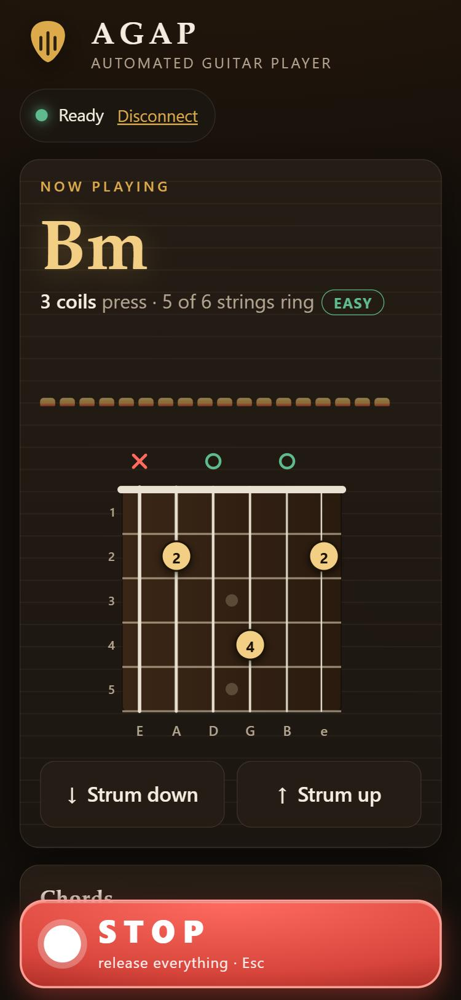
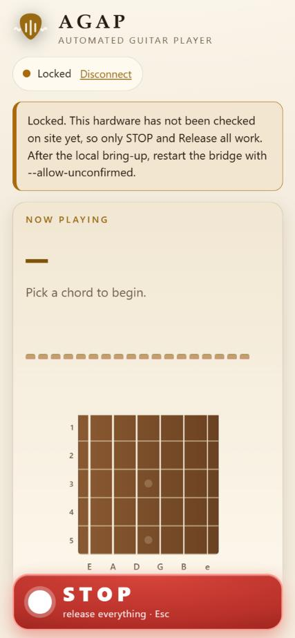

# AGAP remote-control bridge

Lets you drive the robot from a phone or another computer.

```
browser / phone --HTTP--> bridge (Pi or PC next to the robot) --USB serial--> Mega firmware
```

The bridge runs on the machine plugged into the Mega. There is no cloud
server to build or pay for: to reach the bridge from outside your network,
put it behind a tunnel or VPN (Tailscale, Cloudflare Tunnel, SSH) instead of
opening a router port. The bridge has no TLS of its own.

## Run it

```bash
pip install pyserial
python agap_bridge.py --port COM5 --fretboard       # the final 30-solenoid firmware
python agap_bridge.py --port COM5                   # the earlier chord-helper firmware
python ../agap.py bridge                            # same, port found for you, fretboard by default
```

It prints a token. Open `http://localhost:8080`, paste the token, and you get the
phone page described below.

**Two modes.** `--fretboard` (the final design) accepts chord names such as `F#m7`
and the board solves them. Without it the bridge only accepts the labels in
`button_map.json` (the earlier chord-helper build).

**Fretboard mode starts locked.** Until you pass `--allow-unconfirmed`, only
`stop` and `release` are accepted: nothing about this hardware has been checked
locally yet, and a remote operator cannot see the robot. Do the local bring-up
first (`python ../agap.py bringup`), then turn it on.

No board yet? `python agap_bridge.py --simulate --fretboard --allow-unconfirmed`
runs against a stand-in so you can try the page. In fretboard mode the stand-in
answers `CHORD` / `SHOW` / `SEQUENCE` with a fingering line in the firmware's own
format (`Bm -> x 2 0 4 0 2  (cost 9)`, solved by ChordAI over frets 0-5), so the
page has something real to draw. It does not emulate the firmware's timing or state:
a sequence's chords all appear at once, not one per beat.

**Better: try it on the real firmware logic, no board needed.**

```bash
python ../agap.py demo                       # builds AGAP_Fretboard.ino for this PC and runs the bridge on it
python ../agap.py demo --http-port 8777      # if port 8080 is taken
python agap_bridge.py --sim-exe PATH_TO_BUILT_sim_serve --fretboard --allow-unconfirmed   # the same, by hand
```

The sketch's own parser, chord search and coil logic run on this computer against a mock Arduino
(needs `g++`), so every reply is the firmware's, not a guess. Still no real timing or electronics.

## The phone page ("AGAP Stage")

A musical stage theme: walnut and brass in the dark, warm sheet-music paper in the
light (it follows the phone's setting), with no external fonts, scripts or images, so it
works on a network with no internet.

| Screenshot | |
|---|---|
|  | Desktop: the chord **Bm** playing, with its fingering drawn on a fretboard |
|  | Phone, dark theme |
|  | Phone, light theme, **locked** bridge |

What is on it:

- **Now playing**: the chord name, how many coils press and how many strings ring, an
  easy / moderate / hard badge from the board's own cost figure, and the fingering drawn on
  a fretboard (low E on the left; x = muted, o = open, numbered dots = pressed). It is drawn
  from what the **board actually replied**, not from what the page expected.
- **Strum down / up**, **chord keys** (major, minor, sevenths) and a box for any chord name.
- **Setlist**: tap a preset (Pop, Folk, Blues, Ballad) or type chords, set the tempo, play.
  The chip of the chord the board last reported lights up.
- **STOP** is a large bar fixed to the bottom of the screen at all times, never disabled;
  **Esc** does the same on a keyboard.
- **Honest states.** *Locked* (a fretboard bridge started without `--allow-unconfirmed`)
  disables everything except STOP and Release all, and says why. *Busy* disables everything
  except STOP, matching what the bridge would refuse with 409. *Offline* appears after the
  first failed poll and says whether the bridge or the board link is down, plus that the board
  releases its coils by itself after 8 seconds without a command.

How it is built: `index.html` (markup), `ui.css` (themes), `ui_logic.js` (every decision:
reading the board's reply, what is allowed in each state, chord and progression rules; no
DOM, so Node can test it) and `app.js` (drawing and fetching only). The bridge serves exactly
those four files without a token, nothing else on disk, and sends a strict
Content-Security-Policy on every response (own files only, no inline script or style, no
`eval`), so even a page-injection bug could not load or run outside code. The token is kept
only in that browser tab's `sessionStorage`; **Disconnect** removes it. Restart the bridge after
editing the page files: it reads them once at startup.

Options: `--host` (default 127.0.0.1), `--http-port`, `--map`, `--token`
(or `AGAP_BRIDGE_TOKEN`; 16+ characters), `--allow-calib`,
`--allow-unconfirmed`, `--fretboard`.

## What it enforces

| Rule | Why |
|---|---|
| Token on every API call | Anyone who can send a command moves hardware |
| Fixed list of actions (chord, press, release, strum, sequence, calib, stop); no raw passthrough | A client can't inject a firmware command. In helper mode only labels read from `button_map.json` are written to the port; in fretboard mode a chord name must match `[A-G][#b]?` plus up to 10 ASCII letters, digits, `+` or `-` (checked with a full match, so a trailing newline cannot slip through), and `press`/`calib` take only a string 1-6 and a fret 1-5 as integers |
| STOP always accepted at once, even mid-sequence | Nobody can watch the robot remotely, so cancelling must never be blocked |
| Other commands refused (409) while a sequence runs; rate-limited (429) | Prevents queueing up presses on a robot you can't see |
| Buttons not `"confirmed"` in `button_map.json` refused (403) unless `--allow-unconfirmed` | The chord labels are still unverified guesses (README_AGAP.md step 1) |
| `calib` off unless `--allow-calib`, then capped (hold <= 2 s, reps <= 10, gap >= 0.5 s) | Repeated presses can heat a coil |
| Sequence <= 16 chords, 20-200 bpm; body <= 2 KB | Bounds a bad request |
| Only `/`, `/ui.css`, `/ui_logic.js`, `/app.js` served without a token; strict Content-Security-Policy on every response | No file on the robot's computer is reachable, and the page can't run or load outside code |
| STOP sent when the bridge exits; 401 replies delayed | Fail safe; slows token guessing |

The firmware's own 8-second auto-release still applies underneath all of
this, so a dropped connection mid-chord does not leave a coil on.

## API

All calls need `Authorization: Bearer <token>`.

- `GET /api/status`: connection, busy flag, button list
- `GET /api/log`: the last board replies
- `POST /api/command` with a JSON body, e.g.
  `{"action":"chord","target":"Em"}` (fretboard: any chord name, `F#m7`),
  `{"action":"press","string":6,"fret":1}` (fretboard only),
  `{"action":"sequence","targets":["C","G","Am","F"],"bpm":50}`,
  `{"action":"stop"}`

## Tests

```bash
python -m unittest test_agap_bridge test_agap_ui -v      # 40 + 31 tests, no board needed
node ui_logic_test.js                                    # 44 checks of the page logic (Node)
python -m unittest test_agap_e2e -v                      # 14 tests: page -> bridge -> the REAL sketch (needs g++)
```

`test_agap_ui` covers what the bridge serves (the four files, nothing else, the policy
header), the page source (no external URL, no inline script, style or handler, no `eval` or
`innerHTML`, valid JavaScript, every action the page sends is one the bridge accepts), that
the page's chord-name filter and limits are **identical** to the bridge's, that the page reads
every fingering the simulator prints exactly as ChordAI solved it, and the whole flow over
real HTTP (chord, drawn fingering, locked, busy, STOP). Details and the bugs found are in
[`../docs/TEST_PLAN.md`](../docs/TEST_PLAN.md).

The bridge tests cover auth, command-injection attempts, the allowlist, the unconfirmed and
calib gates, limits, busy/STOP priority, rate limiting, STOP on shutdown, and
the HTTP layer. I also broke the auth check and the STOP priority on purpose
to confirm the tests fail when they should.

## Not verified

None of this has run against a real board. The page has been looked at in the desktop app's
built-in browser (desktop and phone width, dark and light, locked, busy, STOP, bridge killed
mid-session) against the simulator, but not on a real phone, over a tunnel, or in Safari. The serial link to the Mega
(`SerialLink`) has not been exercised, and the remote path has not been
tested over a real tunnel. Do the bench steps in `README_AGAP.md` first.
